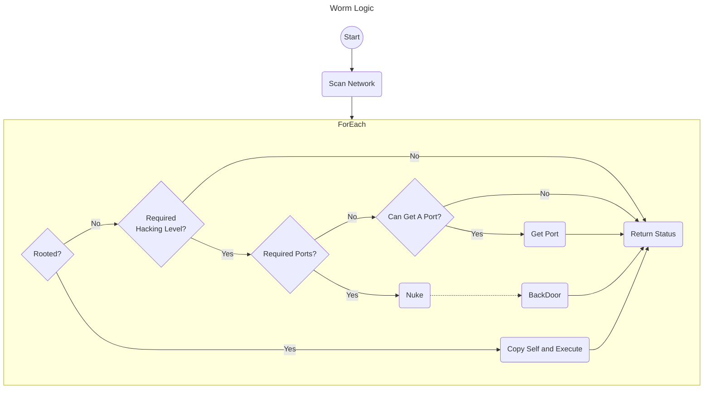
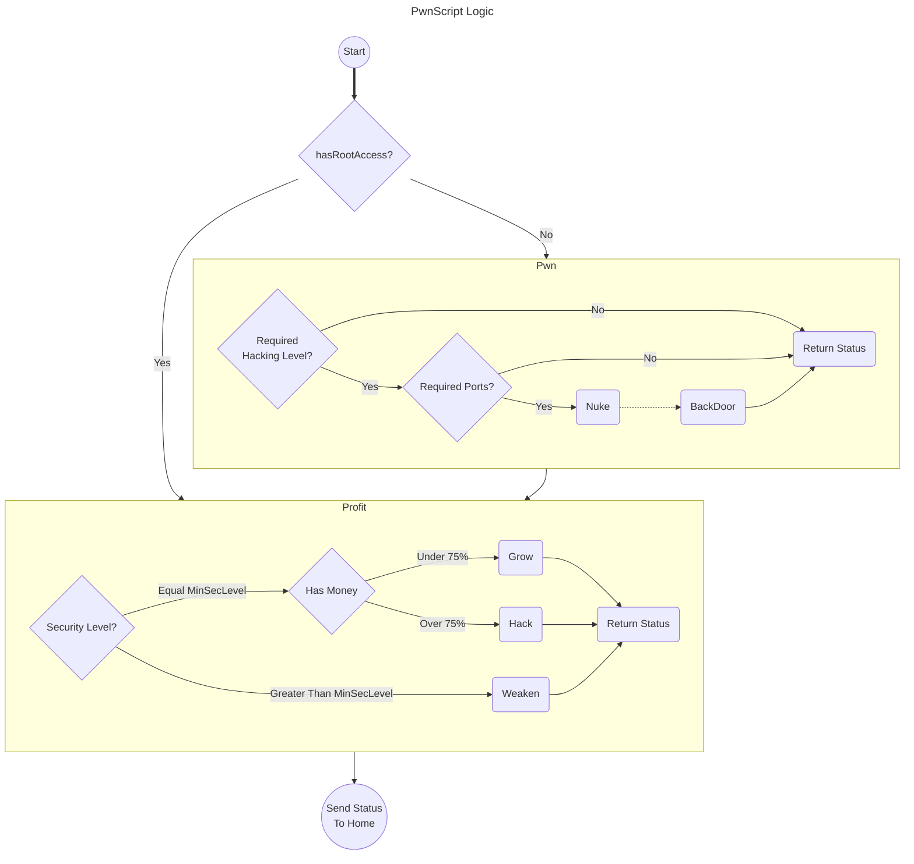

# BitBunner Notes:

This is an attempt to build a all in one script (autoscan.js) to play bitburner.

The only cheat currently used is max RAM used bypass ( get docmuent via eval ).

- usage: run autoscript.js [w] 

with the W set it will run in worm mode following Worm logic below.
withou the W it will run as a network display on homeo only. else it will run PwnScript Logic below.

Many many many features missing but is a good start.

--------------------------------------

--------------------------------------

--------------------------------------